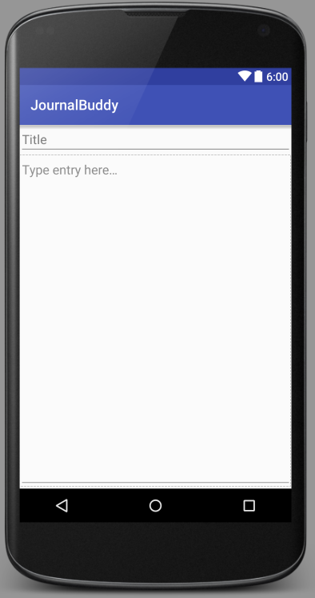

Journal buddy is my first official foray into Android app development. I have a vague sense of what I'm doing, but overall I'm still completely lost. I'm going to jot down a preliminary description for what I want JournalBuddy to do, and try and develop to those standards.

JournalBuddy is a simple journaling application for Android. The user creates entries every day, with a simple title and then an entry body. 

The journal entries can be saved by the user. I'm still deciding if the entries should be saved in Internal memory, where the often personal journal entries can't be seen by others. Or, the entries could be saved in external memory as plain text files, so the user could easily export them or read them using another application if so desired. 

The other key feature of the JournalBuddy will be the "pestering" feature, where the application will notify the user if they have not made an entry in a certain amount of time (user specified, will default to 24 hours). 
Ideally, the app has a mascot or is personified in some fashion, and notifications will take the tone of a friend kindly suggesting you to do something. Rather than being a simple and mostly useless word processor for Android, I envision JournalBuddy as a sort of confidant for people, adding the Dear to "Dear Journal,". Hopefully this will encourage people to use the app more, and build up a sizable collection of journal entries. 

As a stretch goal, I would like to see if I can export text entries from the app [MoodTools](https://play.google.com/store/apps/details?id=com.moodtools.moodtools&hl=en). MoodTools first gave me the inspiration to write JournalBuddy, and it would be nice to allow people to export their Thought Journal entries to make transitioning between apps much smoother. 

I know this has been a very general overview, but it's helpful to get my ideas "on paper" so I can begin making concrete goals for development. 