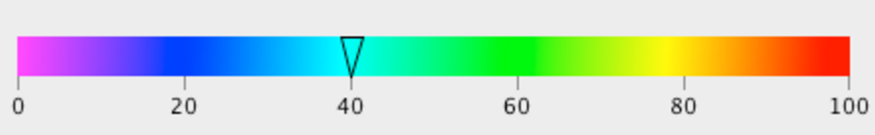
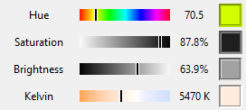

If you've ever used any image/video editing software, you've likely come across a color-slider looking something like 
this:



Sure, the user could just move a blank slider and see how the colors change, but having the color gradient reside **on**
the slider gives the user a much more innate sense of what color they're selecting. This lets them click on the slider
potentially just once, and get the right value the first time. 

Tkinter, bless its heart, has not seem to have caught up with the color slider revolution. The only slider Tk provides 
is the `Scale` widget, which features almost no graphical customization. However, the scale widget is nicely programmed, 
and has all the other expected features built in, which is why so many are hesitant to switch away. However, the `Scale`
widget can be recreated in a `Canvas` widget, meaning the sky's the limit on how much graphical customization you 
desire.

Note: This code is based on the 
[gradientbar.py](https://github.com/j4321/tkColorPicker/blob/master/tkcolorpicker/gradientbar.py) code from the 
`tkColorPicker` repository. 

```python
import tkinter as tk

class ColorScale(tk.Canvas):

    def __init__(self, parent, val=0, height=13, width=100, variable=None, from_=0, to=360, command=None,
                 gradient='hue', **kwargs):
        """
        Create a ColorScale.
        Keyword arguments:
            * parent: parent window
            * val: initially selected value
            * height: canvas length in y direction
            * width: canvas length in x direction
            * variable: IntVar linked to the alpha value
            * from_: The minimum value the slider can take on
            * to: The maximum value of the slider
            * command: A function callback, invoked every time the slider is moved
            * gradient: The type of background coloration
            * **kwargs: Any other keyword argument accepted by a tkinter Canvas
        """
        tk.Canvas.__init__(self, parent, width=width, height=height, **kwargs)
        self.parent = parent
        self.max = to
        self.min = from_
        self.range = self.max - self.min
        self._variable = variable
        self.command = command
        self.color_grad = gradient
        if variable is not None:
            try:
                val = int(variable.get())
            except Exception as e:
                print(e)
        else:
            self._variable = tk.IntVar(self)
        val = max(min(self.max, val), self.min)
        self._variable.set(val)
        
        self._variable.trace("w", self._update_val)

        self.gradient = tk.PhotoImage(master=self, width=width, height=height)
        
        self.bind('<Configure>', lambda e: self._draw_gradient(val))
        self.bind('<ButtonPress-1>', self._on_click)
        self.bind('<ButtonRelease-1>', self._on_release)
        self.bind('<B1-Motion>', self._on_move)
```

The initialization of the ColorScale widget follows a lot of the same patterns that the `Scale` widget has. This is 
because, ideally, a `Scale` can be substituted with a `ColorScale` with no other code changes.

Shortly after, we initialize the `Canvas` object, and assign the variable to class variables. One interesting thing of 
note is that if a tkinter variable isn't passed as `variable`, the code will create a new one for the slider. This way 
the value of the slider is always accessible. Finally, the variable is initialized to `val`. 

We trace the variable the slider represents with the callback `self._update_val`, which will be described later. 
`self.gradient` will hold the background image for the slider.

Finally we add the bindings to the various callback functions. `<Configure>` will be called when the widget is initially
 drawn, so that's where we'll build the background image using the function specified by the `gradient` parameter. `_on_click` and
 `_on_move` will work similarly, changing `_variable` and updating the GUI accordingly. It will also feature a callback
 to the optional `command` parameter. 
 
 ```python
    def _draw_gradient(self, val):
        """Draw the gradient and put the cursor on val."""
        self.delete("gradient")
        self.delete("cursor")
        del self.gradient
        width = self.winfo_width()
        height = self.winfo_height()

        self.gradient = tk.PhotoImage(master=self, width=width, height=height)

        line = []

        if self.color_grad == 'bw':
            def f(i):
                line.append(tuple2hex((int(float(i) / width * 255),) * 3))
        elif self.color_grad == 'wb':
            def f(i):
                line.append(tuple2hex((int((1 - (float(i) / width)) * 255),) * 3))
        elif self.color_grad == 'kelvin':
            def f(i):
                line.append(tuple2hex(KelvinToRGB(((float(i) / width) * self.range) + self.min)))
        elif self.color_grad == 'hue':
            def f(i):
                line.append(tuple2hex(HueToRGB(float(i) / width * 360)))
        else:
            raise ValueError("gradient value {} not recognized".format(self.color_grad))

        for i in range(width):
            f(i)
        line = "{" + " ".join(line) + "}"
        self.gradient.put(" ".join([line for j in range(height)]))
        self.create_image(0, 0, anchor="nw", tags="gradient", image=self.gradient)
        self.lower("gradient")

        x = (val - self.min) / float(self.range) * width
        self.create_line(x, 0, x, height, width=4, fill='white', tags="cursor")
        self.create_line(x, 0, x, height, width=2, tags="cursor")
```

`_draw_gradient` is the configuration function that will draw the background image. It also initially draws the "cursor"
which is simply two black and white rectangles on top of each other. This simple contrast allows the cursor to be seen on
any background. It begins by clearing the previous elements off the
canvas. `line` will be the string holding the hexadecimal values generated by the gradient function. This is where the 
parameter `color_grad` comes in. We define the function `f()` on what the user wants the background to be. You can add 
any other functions you want. Since this was created for my `LIFX-Control-Panel` project, I wanted black-to-white('bw'),
white-to-black('wb'), color temperature ('kelvin'), and hue rainbow ('hue'). Because I needed to convert the values 
returned from these functions to RGB hexadecimal format, I had to scale values manually. If you wanted to, you could 
scale the values beforehand, and then pass `gradient` as a function callback. 

Finally, the function is called to create the gradient for each pixel in `width`, and entered into the `PhotoImage`. The
`PhotoImage` is drawn on the `Canvas`, along with the cursor (in the correct position). 


```python
    def _on_click(self, event):
        """Move selection cursor on click."""
        x = event.x
        if x >= 0:
            width = self.winfo_width()
            for s in self.find_withtag("cursor"):
                self.coords(s, x, 0, x, self.winfo_height())
            self._variable.set(round((float(self.range) * x) / width + self.min, 2))
            if self.command is not None:
                self.command()

    def _on_move(self, event):
        """Make selection cursor follow the cursor."""
        if event.x >= 0:
            w = self.winfo_width()
            x = min(max(abs(event.x), 0), w)
            for s in self.find_withtag("cursor"):
                self.coords(s, x, 0, x, self.winfo_height())
            self._variable.set(round((float(self.range) * x) / w + self.min, 2))
            if self.command is not None:
                self.command()
```

Both `_on_click` and `_on_move` are `Canvas` callbacks that will be triggered when the canvas is clicked, and dragged 
respectively. We first check to see if the event has a positive x coordinate, as dragging behind a canvas can cause a 
"mirroring" effect. We then take redraw the cursor at the correct location, set the `IntVar()`, and run the callback 
command, if any was provided. 

```python
    def _on_release(self, event):
        """ Tell the master BulbIconList to update immediately after value is changed. """
        self.master.master.update_icons()
```

I'll quickly note my `_on_release` function. I quickly hacked this in as a way to make my GUI more responsive. It's 
bad design as it's hard-coupled to my application. I have a kinda good reason to do this; updating the icons requires
querying smart lightbulbs, which has significant overhead. Thus, I only want it to happen when the user is "done" making
their selection on the current slider. 

```python
    def _update_val(self, *args):
        val = int(self._variable.get())
        val = min(max(val, self.min), self.max)
        self.set(val)
        self.event_generate("<<HueChanged>>")

    def get(self):
        """Return val of color under cursor."""
        coords = self.coords('cursor')
        width = self.winfo_width()
        return round(self.range * coords[0] / width, 2)

    def set(self, val):
        """Set cursor position on the color corresponding to the value"""
        width = self.winfo_width()
        x = (val - self.min) / float(self.range) * width
        for s in self.find_withtag("cursor"):
            self.coords(s, x, 0, x, self.winfo_height())
        self._variable.set(val)
```

The final 3 functions are for managing changes to the variable. It is clamped to be in the range of `min` and `max`. 
`set` and `get` broker access to the private `_variable`, with set updating the cursor location so it is always in sync.

These scales work almost exactly like the builtin tkinter `Scale` widget. Here's some code from a `Frame` initialization
in LIFX-Control-Panel which shows some `ColorScale`s being initialized.

```python
        self.hsbk_scale = (
            ColorScale(self, to=65535., variable=self.hsbk[0], command=self.update_color_from_ui),
            ColorScale(self, from_=0, to=65535, variable=self.hsbk[1], command=self.update_color_from_ui,
                       gradient='wb'),
            ColorScale(self, from_=0, to=65535, variable=self.hsbk[2], command=self.update_color_from_ui,
                       gradient='bw'),
            ColorScale(self, from_=2500, to=9000, variable=self.hsbk[3], command=self.update_color_from_ui,
                       gradient='kelvin'))
```

And here's what the scales look like once they're `grid`'d into the frame. 



Note that the labels and color displays aren't part of the `ColorScale` widget. They can be easily implemented however,
by using the `get` method and a `trace` on the same variable` 