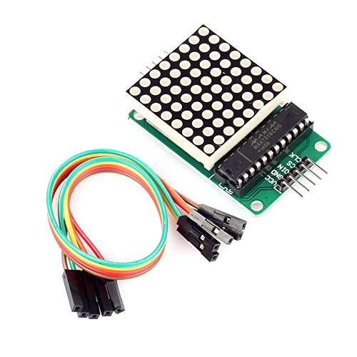

I've had an Arduino for almost 8 years now; I got it as a birthday present from my Dad. And boy, I've gotten a lot of 
use out of the thing. From a makeshift oscilloscope to a 
[quick-and-dirty ESP8266 programmer](https://www.hackster.io/ROBINTHOMAS/programming-esp8266-esp-01-with-arduino-011389)
, the Arduino has served me well. However, as I learned more tools and languages, I began to find the base Arduino 
Sketch language (henceforth referred to as "Sketch(es)", with a capitol 'S') kinda...clunky. Arduino should be all about banging out **quick** prototypes 
that ***work***. [Python is basically pseudocode already](https://i.redd.it/gip50r3305vz.jpg), so why waste time thinking 
about all those convoluted bytes and types and curly-braces, when you can start digging into why the project you've been planning 
about all week in the shower doesn't work on a fundamental, logical level. You know, really *get in the zone*.

I went to school for Computer Engineering and have worked 5 months for an embedded-systems design shop, so I have a 
a decent amount of experience with C (of which I consider Sketch to be a derivative). It's not fast to develop in. There's 
a lot of boilerplate code one has to write, usually tightly coupled to whatever hardware or framework you're working with.
On top of that, C isn't object-oriented, and trying to import those design patterns usually ends up feeling like writing 
plain Javascript<sup>1</sup>. That is to say, not good for one's self esteem.

But, I should stop railing against C before I lose all credibility and you stop reading the article. In short; I 
don't like leaving my comfort zone and C makes my brain hurt. Besides, the main star of the show here isn't Python; it's 
the protocol that we're going to use to get Python controlling the Arduino: [Firmata](http://firmata.org/wiki/Main_Page).
Now, Firmata isn't Python specific; in fact that's the whole point. It provides a common interface for many different 
languages to control an Arduino device at around the same speed as a regular Sketch would. It does this by placing the 
Arduino into "slave" mode, and converting it's API calls into commands to send to the Arduino to be immediately executed. 
This is an order of magnitude faster than using `pyserial` to send info to an Arduino running it's own Sketch, as the 
serial port resets after every message, incurring significant overhead. To show-off a project that requires a fast write 
speed, let's write a driver for a 8x8 MAX7219 LED Matrix. 



Before we get started, we need to install Firmata on the Arduino, putting it in slave mode. Luckily, the Arduino IDE comes
it with it included. Simply open the IDE, then go to `File`->`Examples`->`Firmata`->`StandardFirmata`, then we 
upload to our Arduino like any other Sketch file. We 'll also need to install PyFirmata, which is easily done with 
`pip install pyfirmata` from a command prompt. 

Now we're going to look at the code we'll be adapting: a driver for the MAX7219 LED Matrix. [We'll be using code directly 
from the Arduino website](http://playground.arduino.cc/LEDMatrix/Max7219). 

```cpp
int dataIn = 2;
int load = 3;
int clock = 4;
 
int maxInUse = 4;    //change this variable to set how many MAX7219's you'll use
 
int e = 0;           // just a variable
 
// define max7219 registers
byte max7219_reg_noop        = 0x00;
byte max7219_reg_digit0      = 0x01;
byte max7219_reg_digit1      = 0x02;
byte max7219_reg_digit2      = 0x03;
byte max7219_reg_digit3      = 0x04;
byte max7219_reg_digit4      = 0x05;
byte max7219_reg_digit5      = 0x06;
byte max7219_reg_digit6      = 0x07;
byte max7219_reg_digit7      = 0x08;
byte max7219_reg_decodeMode  = 0x09;
byte max7219_reg_intensity   = 0x0a;
byte max7219_reg_scanLimit   = 0x0b;
byte max7219_reg_shutdown    = 0x0c;
byte max7219_reg_displayTest = 0x0f;
 
void putByte(byte data) {
  byte i = 8;
  byte mask;
  while(i > 0) {
    mask = 0x01 << (i - 1);      // get bitmask
    digitalWrite( clock, LOW);   // tick
    if (data & mask){            // choose bit
      digitalWrite(dataIn, HIGH);// send 1
    }else{
      digitalWrite(dataIn, LOW); // send 0
    }
    digitalWrite(clock, HIGH);   // tock
    --i;                         // move to lesser bit
  }
}
 
void maxSingle( byte reg, byte col) {    
//maxSingle is the "easy"  function to use for a single max7219
 
  digitalWrite(load, LOW);       // begin    
  putByte(reg);                  // specify register
  putByte(col);//((data & 0x01) * 256) + data >> 1); // put data  
  digitalWrite(load, LOW);       // and load da stuff
  digitalWrite(load,HIGH);
}
 
void maxAll (byte reg, byte col) {    // initialize  all  MAX7219's in the system
  int c = 0;
  digitalWrite(load, LOW);  // begin    
  for ( c =1; c<= maxInUse; c++) {
  putByte(reg);  // specify register
  putByte(col);//((data & 0x01) * 256) + data >> 1); // put data
    }
  digitalWrite(load, LOW);
  digitalWrite(load,HIGH);
}
 
void maxOne(byte maxNr, byte reg, byte col) {    
//maxOne is for addressing different MAX7219's,
//while having a couple of them cascaded
 
  int c = 0;
  digitalWrite(load, LOW);  // begin    
 
  for ( c = maxInUse; c > maxNr; c--) {
    putByte(0);    // means no operation
    putByte(0);    // means no operation
  }
 
  putByte(reg);  // specify register
  putByte(col);//((data & 0x01) * 256) + data >> 1); // put data
 
  for ( c =maxNr-1; c >= 1; c--) {
    putByte(0);    // means no operation
    putByte(0);    // means no operation
  }
 
  digitalWrite(load, LOW); // and load da stuff
  digitalWrite(load,HIGH);
}
 
 
void setup () {
 
  pinMode(dataIn, OUTPUT);
  pinMode(clock,  OUTPUT);
  pinMode(load,   OUTPUT);
 
  digitalWrite(13, HIGH);  
 
//initiation of the max 7219
  maxAll(max7219_reg_scanLimit, 0x07);      
  maxAll(max7219_reg_decodeMode, 0x00);  // using an led matrix (not digits)
  maxAll(max7219_reg_shutdown, 0x01);    // not in shutdown mode
  maxAll(max7219_reg_displayTest, 0x00); // no display test
   for (e=1; e<=8; e++) {    // empty registers, turn all LEDs off
    maxAll(e,0);
  }
  maxAll(max7219_reg_intensity, 0x0f & 0x0f);    // the first 0x0f is the value you can set
                                                  // range: 0x00 to 0x0f
}  
```

It's not really important that you understand what the code is doing right away. A lot of embedded systems is passing magic numbers 
between devices to initialize them. The key takeaway is the `maxOne`, `maxAll`, and `maxSingle` functions, which handle writing to the 
actual device. We want to wrap this all up in a reusable `LedMatrix` class that we can integrate into other projects. So
without further ado, let's get into the Python code.

```python
"""led_matrix.py"""

from time import sleep

from pyfirmata import Arduino

HIGH = 1
LOW = 0

dataIn = 2
load = 4
clock = 3
maxInUse = 1

max7219_reg_noop = 0x00
max7219_reg_digit0 = 0x01
max7219_reg_digit1 = 0x02
max7219_reg_digit2 = 0x03
max7219_reg_digit3 = 0x04
max7219_reg_digit4 = 0x05
max7219_reg_digit5 = 0x06
max7219_reg_digit6 = 0x07
max7219_reg_digit7 = 0x08
max7219_reg_decodeMode = 0x09
max7219_reg_intensity = 0x0a
max7219_reg_scanLimit = 0x0b
max7219_reg_shutdown = 0x0c
max7219_reg_displayTest = 0x0f
```

The header of the file looks very similar to the Sketch's, with the exception of the imports. In addition to `pyfirmata`,
we're going to need `time.sleep` to emulate Sketch's `delay` function. `HIGH` and `LOW` are also defined, just to make 
the code more self-explanatory, and closer to the original Sketch. 

Now, one of the nice things about Python is it's object-oriented design features. In order to encapsulate the functionality
of the LEDMatrix, we're going to create an `LedMatrix` class. This lets us reuse the `LedMatrix` object in other projects.

```python
class LedMatrix:
    def __init__(self, board, dataIn, load, clock, maxInUse=1):
        self._board = board

        self.pins = dict()
        self.pins['dataIn'] = dataIn
        self.pins['load'] = load
        self.pins['clock'] = clock
        self.maxInUse = maxInUse
        
    def _digitalWrite(self, pin, val):
        self._board.digital[pin].write(val)

```

The args we pass are:
* `board` 
  * The `pyfirmata` `Arduino` object. We'll use this to communicate with the LedMatrix. We'll show how to instantiate one 
  at the end (since its actually quite simple). We make it private as other objects shouldn't be interfacing with the 
  `Arduino` through the `LedMatrix` object; that just seems backwards.
* `dataIn`, `load`, `clock`
  * The 3 pins from the LED-Matrix that are connected to the Arduino. These can be pretty arbitrary, as long as they're
  digital output pins.
* `maxInUse`
  * MAX7219 Matrices can be daisy-chained, and this variable allows the object to reference these daisy-chained systems.
  Defaults to 1, however, as that's the most common case.
  
I also included a `_digitalWrite` function as a sort of macro around the `pyfirmata` method of digital writing. We're 
going to be using this function so much that the shorter length and more straightforward syntax pays off. This also has 
the added benefit/drawback of making the code look more like Sketch, which helps people more familiar with Arduino 
understand a little better. Use at your own discretion. With that out of the way, we need a way to communicate with the Matrix.

```python
    def _putByte(self, data):
        for i in range(8, 0, -1):
            mask = 0x01 << (i - 1)
            self._digitalWrite(self.pins["clock"], LOW)
            if data & mask:
                self._digitalWrite(self.pins["dataIn"], HIGH)
            else:
                self._digitalWrite(self.pins["dataIn"], LOW)
            self._digitalWrite(self.pins["clock"], HIGH)
```

`_putByte`, similarly, is used all over the class. It is the function which allows a single 8-bit number to be sent over
the `dataIn` pin to the LED-Matrix, moving bit-by-bit from the largest digit. Also note how this function moves the clock
output `HIGH` and then `LOW`, meaning that 1 bit is sent every clock cycle. Now that we can talk to the Matrix, we will 
get to the bread and butter of the class; the methods which will let light the LEDs.

```python
    def maxSingle(self, reg, col):
        """ Change the row of lights at reg to read as binary of col. """
        self._digitalWrite(self.pins["load"], LOW)
        self._putByte(reg)
        self._putByte(col)
        self._digitalWrite(self.pins["load"], LOW)
        self._digitalWrite(self.pins["load"], HIGH)

    def maxAll(self, reg, col):
        """ Like calling maxSingle on every chained matrix """
        self._digitalWrite(self.pins["load"], LOW)
        for _ in range(0, self.maxInUse):
            self._putByte(reg)
            self._putByte(col)
        self._digitalWrite(self.pins["load"], LOW)
        self._digitalWrite(self.pins["load"], HIGH)

    def maxOne(self, maxNr, reg, col):
        """ Specify the matrix to be written to with maxNr. Then acts as maxSingle on that specific matrix. """
        self._digitalWrite(self.pins["load"], LOW)

        for _ in range(self.maxInUse, maxNr, -1):
            self._putByte(0)
            self._putByte(0)

        self._putByte(reg)
        self._putByte(col)

        for _ in range(maxNr - 1, 0, -1):
            self._putByte(0)
            self._putByte(0)

        self._digitalWrite(self.pins["load"], LOW)
        self._digitalWrite(self.pins["load"], HIGH)
        
    def clear(self):
        for e in range(1, 9):
            self.maxAll(e, 0)
            
    def draw_matrix(self, point_matrix):
        for col, pointlist in enumerate(point_matrix):
            self.maxSingle(col + 1, int(''.join(str(v) for v in pointlist), 2))
```

The reason there are 3 functions is due to the chance of multiple matrices being connected (i.g. self.maxInUse > 1). Their 
specific purpose is explained in the comments. However, the way they speak to the matrices is all the same. Each row has
an associated register (indexed at 1, as 0 is reserved for `max7219_reg_noop`). Then, the row just displays the byte in
binary by lighting up the LEDs with the value of 1. For example, `col=0xF` (15) would display as 00001111, or the first
4 lights off and the last 4 on. These functions just take the `col` value and send it over the "load" line using `_putByte`. 
I've added a `clear` function, which zeros out all the display registers, and `draw_matrix`, allowing us to simply send 
2D matrices as argument and have them drawn to the LED-matrix. 

We've made it this far, and yet we haven't actually set-up the LED matrix. We've left this step for last, as using the 
`maxAll` function allows us to quickly write bytes of data to specific registers across an entire daisy-chain. 

```python
    def setup(self):
        print('Initializing _matrix...')
        self._digitalWrite(13, HIGH)
        self.maxAll(max7219_reg_scanLimit, 0x07)
        self.maxAll(max7219_reg_decodeMode, 0x00)
        self.maxAll(max7219_reg_shutdown, 0x01)
        self.maxAll(max7219_reg_displayTest, 0x00)
        self.clear()
        self.maxAll(max7219_reg_intensity, 0x0f & 0x0f)
        print('Done')
```

Ah yes, the core of embedded systems: magic numbers during device setup. I'll admit, this is the part where I really 
leaned on my "hacker ethos"<sup>2</sup> here, so I didn't bother to read the MAX7219 whitepaper and understand what the
numbers are doing. The Arduino Gods have already bestowed their source code upon us; I don't want to question their 
wisdom and mercy.

With all that out of the way, we're ready to start using our new class! For now, skip the `loop` function and look at
the `if __name__ == "__main__":` block.

```python
def loop(matrix):
    """ Verify that the functions work. """
    matrix.maxSingle(1, 1)
    matrix.maxSingle(2, 2)
    matrix.maxSingle(3, 4)
    matrix.maxSingle(4, 8)
    matrix.maxSingle(5, 16)
    matrix.maxSingle(6, 32)
    matrix.maxSingle(7, 64)
    matrix.maxSingle(8, 128)
    sleep(.25)
    matrix.clear()
    sleep(.25)
    matrix.maxAll(1, 1)
    matrix.maxAll(2, 3)
    matrix.maxAll(3, 7)
    matrix.maxAll(4, 15)
    matrix.maxAll(5, 31)
    matrix.maxAll(6, 63)
    matrix.maxAll(7, 127)
    matrix.maxAll(8, 255)
    sleep(.25)
    matrix.clear()
    sleep(.25)
    x = [[1, 0, 0, 0, 0, 0, 0, 1],
         [0, 1, 0, 0, 0, 0, 1, 0],
         [0, 0, 1, 0, 0, 1, 0, 0],
         [0, 0, 0, 1, 1, 0, 0, 0],
         [0, 0, 0, 1, 1, 0, 0, 0],
         [0, 0, 1, 0, 0, 1, 0, 0],
         [0, 1, 0, 0, 0, 0, 1, 0],
         [1, 0, 0, 0, 0, 0, 0, 1]]
    matrix.draw_matrix(x)
    sleep(.25)
    matrix.clear()
    sleep(.25)


if __name__ == "__main__":
    board = Arduino('COM3')
    matrix = LedMatrix(board, 2, 4, 3)
    matrix.setup()
    while True:
        loop(matrix)

```

We begin by initializing a connection to the Arduino by instantiating an `Arduino` object (from `pyfirmata`). Note, this
will take exclusive control of whatever serial port you provide (`COM3` in this case). If any other process is using this
USB port, the program will fail. 

We then continue by  instantiating our `LedMatrix` object, providing our `Arduino` instance and the pins `dataIn`, `load`, and
`clock`. We're just using 1 MAX7219, so we don't pass any number for `maxInUse`. It's important that we setup the matrix
before we use it, as it could be carrying over incorrect settings from previous use, making debugging especially confusing.
Finally, utilizing the design pattern from Sketch, we call `loop` in an infinite loop. 

`loop` simply draws 3 shapes (line, right triangle, X) to the screen over-and-over, verifying the device works. It will 
be called over and over, until the program is terminated with `Ctrl+C` or some other kill signal. This is similar to how
loop works in Sketches as well. 

If all goes well, you should see `Diagonal` -> `Triangle` -> `X` -> `Diagonal` -> `...`. If you're having problems, try
uploading the original Arduino Sketch and make sure that it works. One problem I had with my particular matrix was that 
the actual LED array was mounted backwards on the board, and so the lights were changing seemingly at random. Also, 
remember that row indices begin at `1`, not `0`. 

Using the code from the main loop as an example, you can instantiate and use the matrix anywhere you want. I've got mine
displaying Discord mic connection status, which I might explain in another article. 

<br />
---

<sup>1</sup>I shouldn't slight Javascript though, as I actually found out about Firmata through the Node.js library 
[Johnny-Five](http://johnny-five.io/), which also has a built-in LED-Matrix support (meaning you wouldn't have had to do
this tutorial). Go check it out.

<sup>2</sup>Read "arrogant and lazy"