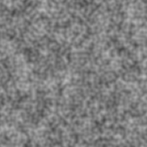

First of all, I would like to say that the code in this post was inspired by Adrian Biagioli's article on Perlin Noise,
which can be found [here](http://flafla2.github.io/2014/08/09/perlinnoise.html). That being said, this really isn't going
to be a primer on Perlin Noise, and is mostly going to focus on its implementation in Python. First, a recap of the 
converted C++ code from Adrian's article.

We start by creating the permutation array which later gives us our 'random' gradients.

```python
from collections import namedtuple

p = [151, 160, 137, 91, 90, 15,
     131, 13, 201, 95, 96, 53, 194, 233, 7, 225, 140, 36, 103, 30, 69, 142, 8, 99, 37, 240, 21, 10, 23,
     190, 6, 148, 247, 120, 234, 75, 0, 26, 197, 62, 94, 252, 219, 203, 117, 35, 11, 32, 57, 177, 33,
     88, 237, 149, 56, 87, 174, 20, 125, 136, 171, 168, 68, 175, 74, 165, 71, 134, 139, 48, 27, 166,
     77, 146, 158, 231, 83, 111, 229, 122, 60, 211, 133, 230, 220, 105, 92, 41, 55, 46, 245, 40, 244,
     102, 143, 54, 65, 25, 63, 161, 1, 216, 80, 73, 209, 76, 132, 187, 208, 89, 18, 169, 200, 196,
     135, 130, 116, 188, 159, 86, 164, 100, 109, 198, 173, 186, 3, 64, 52, 217, 226, 250, 124, 123,
     5, 202, 38, 147, 118, 126, 255, 82, 85, 212, 207, 206, 59, 227, 47, 16, 58, 17, 182, 189, 28, 42,
     223, 183, 170, 213, 119, 248, 152, 2, 44, 154, 163, 70, 221, 153, 101, 155, 167, 43, 172, 9,
     129, 22, 39, 253, 19, 98, 108, 110, 79, 113, 224, 232, 178, 185, 112, 104, 218, 246, 97, 228,
     251, 34, 242, 193, 238, 210, 144, 12, 191, 179, 162, 241, 81, 51, 145, 235, 249, 14, 239, 107,
     49, 192, 214, 31, 181, 199, 106, 157, 184, 84, 204, 176, 115, 121, 50, 45, 127, 4, 150, 254,
     138, 236, 205, 93, 222, 114, 67, 29, 24, 72, 243, 141, 128, 195, 78, 66, 215, 61, 156, 180]
p.extend(p)

Vector = namedtuple('Vector', 'x y z')


```

Luckily, instead of having to manually double the array, we can just use `list.extend(list)` to do that in one line. 

We've also taken the liberty of creating a `Vector` named-tuple class, which makes keeping track of `x y z` that much 
easier. 

We're now ready to begin implementing the actual Perlin algorithm.

```python
import math
def perlin(x, y, z):
    arglist = Vector(x, y, z)
    if repeat > 0:
        arglist = Vector(*map(lambda x: x % repeat, arglist))
    float_args, int_args = [Vector(*l) for l in zip(*list(map(math.modf, arglist)))]
    int_args = Vector(*map(int, int_args))
    ...
```

Note, I kept the function signatures the same as the C++ code, instead of converting them to take a single `Vector`, so 
they could be used similarly to how they are in the tutorial. However, once we've entered the function, anything is fair 
game. So we convert them into a `Vector`, then use `math.modf` to split the values into `int` and `float` parts. 

The `fade` function is trivial to implement, as it simply returns 6t<sup>5</sup>-15t<sup>4</sup>+10t<sup>3</sup>, and 
luckily, we can simply map the function over the `float_args`.

```python
def fade(t):
    return 6*t**5 - 15*t**4 + 10*t**3
    
def perlin(x, y, z):
    ...
    fade_vector = Vector(*map(fade, float_args))
    ...

```

Now, I'll be the first to admit, my implementation of the `hash` and `inc` functions aren't very Pythonic, and still
carries the C "accent" of the source material. I'm sure there some matrix or combinatoric operation going on here that's
built in. At the very least, I could find a way to rip out the `inc` method and write it straight into the `perlin` function
while still maintaining the 'repeat' functionality. However, because I understand this part the least, I'm most tempted 
to leave it alone.

```python
def inc(num):
    num += 1
    if repeat > 0:
        num %= repeat
    return num
        
def perlin(x, y, z):
    ...
    aaa = hash_row(*int_args)
    aba = hash_row(int_args.x, inc(int_args.y), int_args.z)
    aab = hash_row(int_args.x, int_args.y, inc(int_args.z))
    abb = hash_row(int_args.x, inc(int_args.y), inc(int_args.z))
    baa = hash_row(inc(int_args.x), int_args.y, int_args.z)
    bba = hash_row(inc(int_args.x), inc(int_args.y), int_args.z)
    bab = hash_row(inc(int_args.x), int_args.y, inc(int_args.z))
    bbb = hash_row(*map(inc, int_args))
    ...
```

The `grad` function's goal is to generate the random vectors for the unit cube currently being processed. The article 
presents two ways of doing this.

```python
def grad_slow(hash_list, x, y, z):
    h = hash_list & 15
    u = x if h < 8 else y
    if h < 4:
        v = y
    elif h == 12 or h == 14:
        v = x
    else:
        v = z
    return (u if (h & 1) == 0 else -u) + (v if (h & 2) == 0 else -v)
    
def grad_fast(hash_list, x, y, z):  # Will be referred to as just 'grad' from now on.
    switch = hash_list & 0xF
    if switch == 0x0:
        return x + y
    elif switch == 0x1:
        return -x + y
    elif switch == 0x2:
        return x - y
    elif switch == 0x3:
        return -x - y
    elif switch == 0x4:
        return x + z
    elif switch == 0x5:
        return -x + z
    elif switch == 0x6:
        return x - z
    elif switch == 0x7:
        return -x - z
    elif switch == 0x8:
        return y + z
    elif switch == 0x9:
        return -y + z
    elif switch == 0xA:
        return y - z
    elif switch == 0xB:
        return -y - z
    elif switch == 0xC:
        return y + x
    elif switch == 0xD:
        return -y + z
    elif switch == 0xE:
        return y - x
    elif switch == 0xF:
        return -y - z
```

These two functions essentially produce the same results. However, `grad_fast` simply returns the pre-calculated results
for the entire state space of `hash_list & 0x0F`. This means we only have to make 1 comparison instead of 6, and one logical
AND statement instead of 3. Because of this, henceforth `grad` will refer to `grad_fast`. 

Now, we add a quick linear interpolation function, `lerp`.

```python
def lerp(a, b, x):
    return a + x * (b - a)
```

And we are ready to put it all together at the end of the `perlin` function.

```python
    x1 = lerp(grad(aaa, *float_args), grad(baa, float_args.x - 1, float_args.y, float_args.z), fade_vector.x)
    x2 = lerp(grad(aba, float_args.x, float_args.y - 1, float_args.z),
              grad(bba, float_args.x - 1, float_args.y - 1, float_args.z), fade_vector.x)
    y1 = lerp(x1, x2, fade_vector.y)
    x1 = lerp(grad(aab, float_args.x, float_args.y, float_args.z - 1),
              grad(bab, float_args.x - 1, float_args.y, float_args.z - 1), fade_vector.x)
    x2 = lerp(grad(abb, float_args.x, float_args.y - 1, float_args.z - 1),
              grad(bbb, float_args.x - 1, float_args.y - 1, float_args.z - 1), fade_vector.x)
    y2 = lerp(x1, x2, fade_vector.y)

    return (lerp(y1, y2, fade_vector.z) + 1) / 2
```

Interpolating from gradients around the unit cube is what gives it it's apparent "coherency".

In order to get a nice output, we try outputting a 2D map. 

```python
import numpy as np
import scipy.misc as smp
# Size of the screen
SCREEN_WIDTH = 300
SCREEN_HEIGHT = 300

# how fine the noise is. lower => finer features
UNIT_CUBE = 128

def main():
    starttime = time()
    data = np.zeros((SCREEN_WIDTH, SCREEN_HEIGHT, 3), dtype=np.uint8)
    # choose a random z-slice to get a random image back. otherwise perlin() always returns the same map (z=0)
    z = randint(1, UNIT_CUBE)

    for x in range(SCREEN_WIDTH):
        for y in range(SCREEN_HEIGHT):
            value = perlin(x // UNIT_CUBE + (x % UNIT_CUBE) / UNIT_CUBE, y // UNIT_CUBE + (y % UNIT_CUBE) / UNIT_CUBE,
                           z)
            data[x, y] = list(map(int, (255 * value, 255 * value, 255 * value)))
            
    img = smp.toimage(data)
    img.show()
    print("Time elapsed: " + str(time() - starttime))
```

When we're doing something like `x // UNIT_CUBE + (x % UNIT_CUBE) / UNIT_CUBE` in our call to `perlin`, we're trying to 
convert from the pixel coordinate system to the UNIT_CUBE coordinate system. This way, we get nice floating point input
numbers for x, y and z. 

Your output might look something like this: 


In order to add more feature diversity to the noise, we can implement the `OctavePerlin` function, which sums together
 perlin 'waveforms' with different `amplitudes` and `frequencies`.
 
 ```python
def octave_perlin(x, y, z, octaves, persistence):
    total = 0
    frequency = 1
    amplitude = 1
    maxValue = 0
    for i in range(octaves):
        total += perlin(x * frequency, y * frequency, z * frequency) * amplitude
        maxValue += amplitude
        amplitude += persistence
        frequency *= 2
    return total / maxValue
```

Using the parameters `octaves = 5` and `persistence = 0.75`, I got this image:



This marks the end of the "official" Perlin Tutorial. However, I wasn't satisfied, and I wanted to add color to the nosie (so it would
look like a heatmap). 

In order to do this, we first need to find a way to map [0.0-1.0] to a color gradient. Luckily, I already had a `HuetoRGB`
function around that would convert an angle in degrees [0-360] to an RGB color [0-255][x3]

```python
def HueToRGB(h, s=1, v=1):
    h = float(h)
    s = float(s)
    v = float(v)
    h60 = h / 60.0
    h60f = math.floor(h60)
    hi = int(h60f) % 6
    f = h60 - h60f
    p = v * (1 - s)
    q = v * (1 - f * s)
    t = v * (1 - (1 - f) * s)
    r, g, b = 0, 0, 0
    if hi == 0:
        r, g, b = v, t, p
    elif hi == 1:
        r, g, b = q, v, p
    elif hi == 2:
        r, g, b = p, v, t
    elif hi == 3:
        r, g, b = p, q, v
    elif hi == 4:
        r, g, b = t, p, v
    elif hi == 5:
        r, g, b = v, p, q
    r, g, b = int(r * 255), int(g * 255), int(b * 255)
    return r, g, b
```

Then, we add the function to our image generator in `main`:

```python
def main():
    starttime = time()
    data = np.zeros((SCREEN_WIDTH, SCREEN_HEIGHT, 3), dtype=np.uint8)
    # choose a random z-slice to get a random image back. otherwise perlin() always returns the same map (z=0)
    z = randint(1, UNIT_CUBE)

    for x in range(SCREEN_WIDTH):
        for y in range(SCREEN_HEIGHT):
            value = perlin(x // UNIT_CUBE + (x % UNIT_CUBE) / UNIT_CUBE, y // UNIT_CUBE + (y % UNIT_CUBE) / UNIT_CUBE,
                           z)  # Currently doesn't work with OctavePerlin
            r, g, b = HueToRGB(value * 360)
            data[x, y] = list(map(int, (r, g, b)))
            
    img = smp.toimage(data)
    img.show()
    print("Time elapsed: " + str(time() - starttime))
```

Running this gives us a beautiful image like this one:


The code for this exercise can be found [here](https://github.com/samclane/Perlin_Noise)

In my next Perlin Noise post, I'll be talking about 3D Noise, and the `noise` python library. 