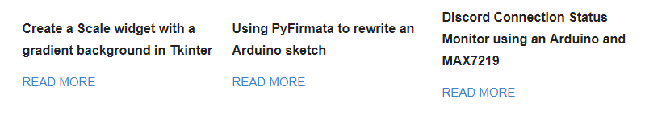

Since I've been getting _some_ traffic to my github-pages blog via Reddit and LinkedIn, I thought it would be a good idea to start
looking at the Google Analytics page. I didn't really know why I was signing up for Analytics when I first started this
blog, but I guess I thought it was cool to be tied in to such a comprehensive metrics system. However, using the system
in a somewhat-serious fashion now, I was exposed to the concept of "bounce rate", which gave a name to a phenomenon I
was familiar with. Essentially, bounce rate is what % of users view only 1 page on your site, then leave (i.e.
bounce<sup><a href="#1">1</a></sup>). It sounded like a gross marketing term, and I, as a noble programmer, wanted no
part of it. But it dawned on me that there was no point in me writing these articles if nobody would ultimately be
exposed to them.

So ideally, when a user is finished consuming one piece of content on your site, you should do your best to spoonfeed
them some additional content they might like. This can be as simple as showing the user several random selections of
content, to incredibly complicated machine-learning models which rely on past user content consumption to inform them to
make better suggestions (like YouTube's recommendations<sup><a href="#2">2</a></sup>).

But today we're going to focus on a super-simple implementation of this content suggestion feature. In this case, all
we're going to do is change our `post` layout to include some links. Since this was my introduction to the Liquid
template language, I didn't get too crazy. But, after we're done, we should get something looking like the bottom of
this article, which should look a little like this:



Let's look at the original `post.html`, which can be found in the `/_layouts` folder.


```html
---
layout: default
---

<article class="post">
  <h1>{{ page.title}}</h1>

  <h5>{{ page.subtitle }}</h5>

  <div class="entry">
    {{ content }}
  </div>

  <div class="date">
    Written on {{ page.date | date: "%B %e, %Y" }}
  </div>

  <!-- This is where our suggestions will go -->

  
    
  
</article>
```


Now, let's look at the `div` element that will contain our suggestions.


```html
  <!-- post.html -->
  ...
  <div class="previewbox">
    
    
      <div class="preview">

        <h1><a href="{{ site.baseurl }}{{ post.url }}">{{ post.title }}</a></h1>

        <a href="{{ site.baseurl }}{{ post.url }}" class="read-more">Read More</a>
      </div>
    
  </div>
  ...
```


We introduce two new classes here: `previewbox` and `preview`. These will be explained more in the CSS section, but
right now, all we need to know is that `previewbox` is the container for several `preview` objects.

We get our list of posts, aptly named `posts`, by filtering whatever the current article is from the list of articles.
We then iterate over the list 3 times, getting the 3 most recent articles (that aren't currently being read by the
user). For each post, we generate a div with the title and a link that says "Read More". In order for this to render
correctly, we must add some CSS.


```css
/* style.scss */

...
.previewbox {
  display: flex;
  justify-content: center;
  align-items: center;
}

.preview {
  font-size: 12px;
  max-width: 240px;
  margin-left: 10px;
  margin-right: 10px;

  h1 {
    font-size: 16px;
  }
}
```

Now, I'll be the first to admit I'm no expert of web development, so this method looks best on desktop browsers, as some
of the absolute positioning can cause "bunching" on mobile devices (although it's far from unreadable). However, the key
formatting points here are that the items will be arranged in a horizontal line, and the fonts will be scaled down from
the regular heading size. They are, after all, just "previews" of the other articles. You could also use `post.excerpt`
to get text from the body of the article, although since `excerpt` gets the whole first paragraph, it can be quite long
and should be truncated somehow.

This is a great first step in getting more users to explore your site. If you don't give them the immediate opportunity
to click onto something new, you're putting it on faith that they're going to first navigate back to your index page,
and from there find something they like. In reality, they're probably going to copy whatever code they need and
move on. But at least give them the chance to see something else they might, maybe, somehow care about. Otherwise,
what's the point of keeping old blog posts in the first place? You might as well delete them after a few months to save
repo space...

---
<sup id="1">1</sup> They had a chance to call it skidaddle rate and they blew it.

<sup id="2">2</sup> Although both you and I know it doesn't really work.