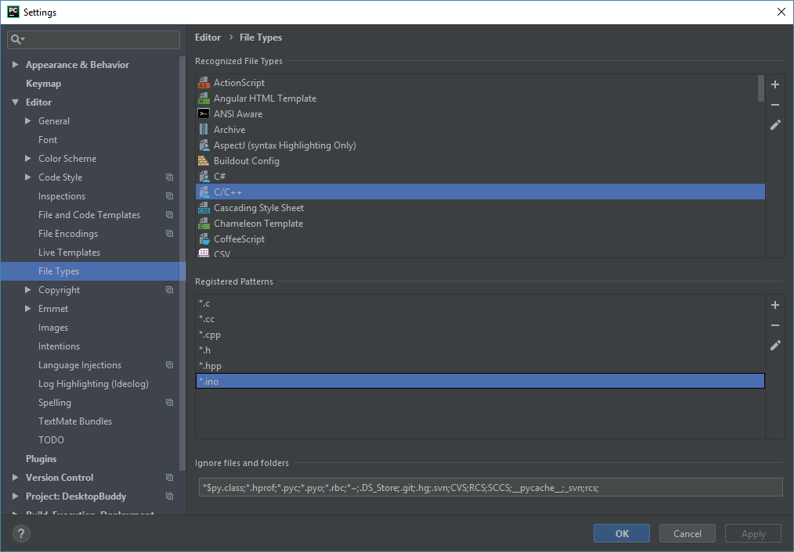
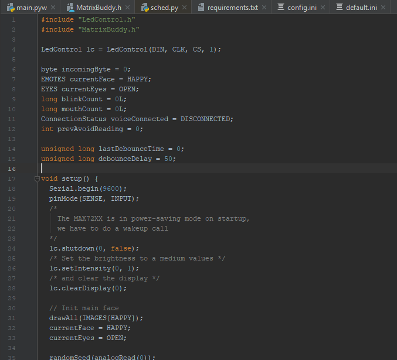
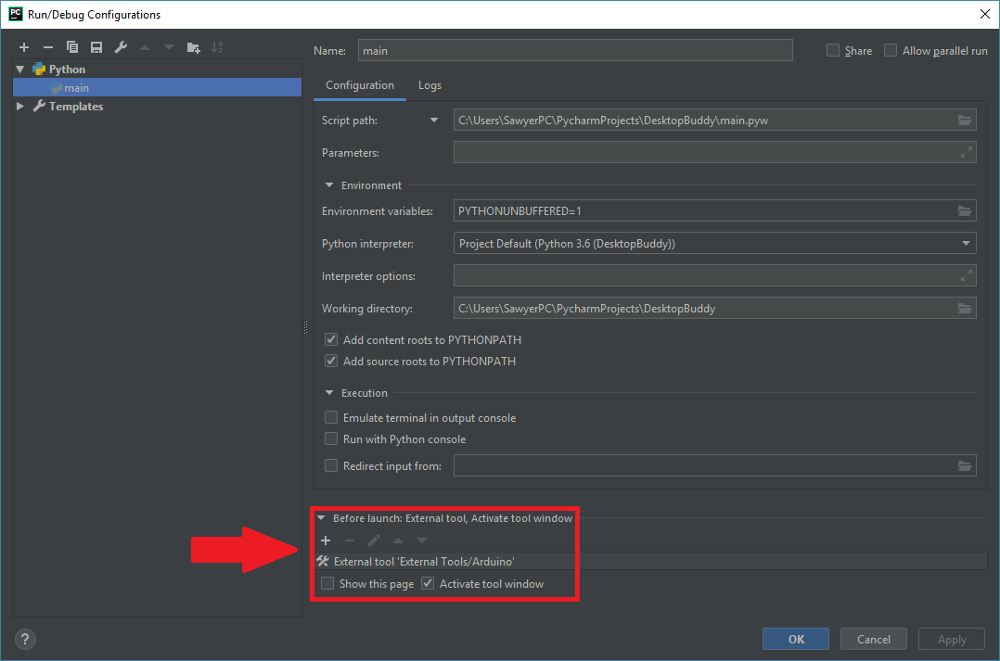
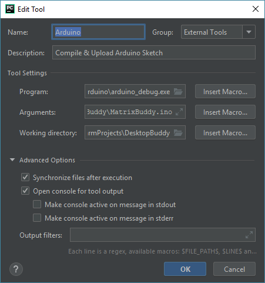

This will be a simple tutorial post, showing how I got my IDE setup to be a suitable replacement for the default Arduino IDE. If you're working on a project where your Python code will be interacting with an Arduino, you may want the Arduino sketch Built + Uploaded before you run your main code. You will also probably want to change your Arduino code without having to open another editor/IDE. This tutorial will cover all these concerns. 

We will be looking at my [DesktopBuddy](https://github.com/samclane/DesktopBuddy) project as an example, as it uses `PySerial` to communicate with an Arduino. Here's the project directory structure:

```
/DesktopBuddy
  /Arduino
    /MatrixBuddy   <---- Root of Arduino Project
      MatrixBuddy.h
      MatrixBuddy.ino
  /venv
  .gitignore
  config.ini
  default.ini
  main.pyw
  README.md
  requirements.txt
  SysTrayIcon.py
  tray_icon.ico
```

### Syntax Highlighting

The first change we want to make is to *enable syntax highlighting for `.ino` files.* This can be accomplished through the "File Types" menu, found in `File->Settings->Editor->File Types`. Under "Recognized File Types", scroll down to "C/C++" and add "*.ino" to the list. 



If you've done this correctly, then your `.h` and `.ino` files should have C-style syntax highlighting.



### Arduino Toolchain

Now for the interesting part. We need to register an "External Tool" with PyCharm that calls the Arduino IDE's Build and Upload function. Adding "External Tools" allow PyCharm to call other command-line functions before running the main script. We can add one by editing our current PyCharm "Configuration". In "DesktopBuddy"'s case, the config is named "main". Clicking the dropdown and selection "Edit Configuration" brings us to the following screen:



Click the small "+" to open the "Add a Tool" dialog. Click the "+" in the next window that pops up to add a new tool. You should see a menu similar to this one (with fewer fields filled in).



Give it a name (I went with the generic "Arduino") and a description. For the "Program:" field, look for your Arduino installation folder. If you're on Windows, the folder should be in `C:\Program Files (x86)\Arduino\`. There should be an `.exe` in the folder named `arduino_debug.exe`. We want to use the `arduino_debug.exe` version, as it has more command line option support than the standard `arduino.exe`. For the parameters, pass the main `.ino` file of our project (`--upload .\Arduino\MatrixBuddy\MatrixBuddy.ino`). We also change the working directory to that of the main project (not necessarily the Arduino project sub-directory). 

To test the new tool config, go to any file, then press `Right Click->External Tools->[Your tool name]`. If things work correctly, you should see console output something like this:

```
"C:\Program Files (x86)\Arduino\arduino_debug.exe" --upload .\Arduino\MatrixBuddy\MatrixBuddy.ino
Looking for library 'user32'
Adding paths from jna.library.path: null
Trying user32.dll
Found library 'user32' at user32.dll
Looking for library 'shell32'
Adding paths from jna.library.path: null
Trying shell32.dll
Found library 'shell32' at shell32.dll
Looking for library 'Ole32'
Adding paths from jna.library.path: null
Trying Ole32.dll
Found library 'Ole32' at Ole32.dll
Loading configuration...
Initializing packages...
Preparing boards...
Verifying...
Archiving built core (caching) in: C:\Users\SawyerPC\AppData\Local\Temp\arduino_cache_387292\core\core_arduino_avr_uno_f91d2b09f572af936e3b3ffff0200535.a
Uploading...
Sketch uses 4250 bytes (13%) of program storage space. Maximum is 32256 bytes.
Global variables use 335 bytes (16%) of dynamic memory, leaving 1713 bytes for local variables. Maximum is 2048 bytes.

Process finished with exit code 0
```

If you're having problems connecting with your Arduino, open your default Arduino IDE and ensure that all connection settings are correctly configured, including which Serial Port is being used. Also make sure that the Serial connection isn't being used by another process. Your Python code could be running in the background and hogging the Serial port, not allowing any other applications to use it. 
 
Another good idea would be to make a copy of the "main" configuration and deleting the call to the "Arduino" tool. That way, you can choose to run your code with/without uploading to your Arduino first.

If you want to learn more about running Arduino from the command-line, the official documentation is [here](https://github.com/arduino/Arduino/blob/master/build/shared/manpage.adoc).