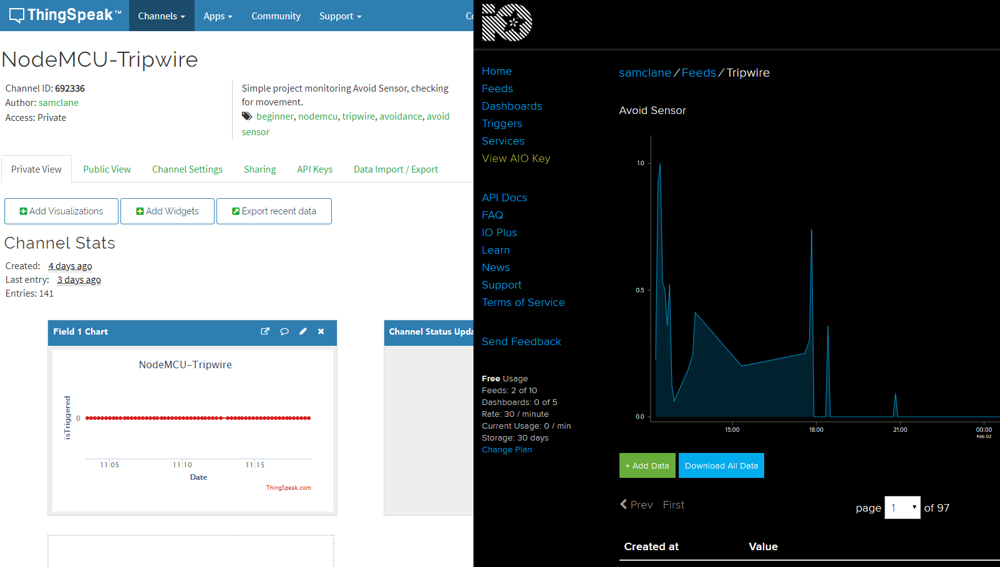
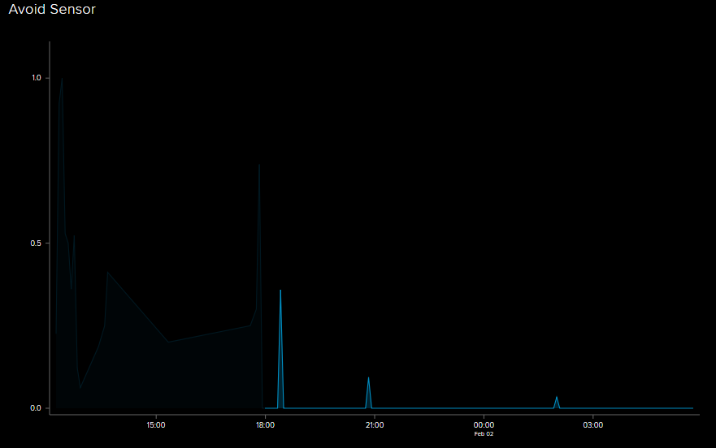

I recently picked up a nodeMCUv3 from AliExpress for real cheap, and I've been looking at adding MQTT to my resume. I've also been wanting to make a wireless tripwire/movement sensor, so now would be the perfect time to build one. I initially chose ThingSpeak as my cloud MQTT broker, but I recently found Adafruit IO, which allows a much faster update period (1 POST per 2 seconds vs. 1 per 30s for ThingSpeak). AIO also seemed to be a lot more intuitive and easy to use. Since the motion sensor is transmitting very simple data ("0" for heartbeat every so often, "1" when the sensor gets tripped), a complex data display/trigger setup isn't required. 

AIO also uses a night theme, where ThingSpeak is blinding white. The choice was obvious.<sup><a href="#1">1</a></sup>



The initial design of the code is very simple and straightforward. 

```c
#include <MQTT.h>
#include <ESP8266WiFi.h>

#define IO_USERNAME  "samclane"
#define IO_KEY       "PRIVATE_KEY"
#define AIO_SERVER      "io.adafruit.com"
#define AIO_SERVERPORT  1883
#define AIO_RATE_S 2

#define AVOID_PIN D0
#define LED_PIN D4

const char ssid[] = "SSID";
const char pass[] = "PASSWORD";

const int sleepTime = 10;

WiFiClient net;
MQTTClient client;

unsigned long lastMillis = 0;
int avoidVal = 1;
int ledVal = LOW;

void connect() {
  Serial.print("Checking wifi...");
  while (WiFi.status() != WL_CONNECTED) {
    Serial.print(".");
    delay(1000);
  }

  Serial.print("\nConnecting...");
  while (!client.connect("nodemcu", IO_USERNAME, IO_KEY)) {
    Serial.print(".");
    delay(1000);
  }

  Serial.println("\nConnected!");

}

void setup() {
  pinMode(AVOID_PIN, INPUT);
  pinMode(LED_PIN, OUTPUT);
  Serial.begin(115200);
  WiFi.begin(ssid, pass);

  client.begin(AIO_SERVER, AIO_SERVERPORT, net);

  connect();
}

void loop() {
  avoidVal = digitalRead(AVOID_PIN);
  digitalWrite(LED_PIN, ledVal);
  ledVal = !ledVal;
  client.loop();
  delay(10);

  if (!client.connected()) {
    connect();
  }

  if (!avoidVal && millis() - lastMillis > AIO_RATE_S*1000) {
    lastMillis = millis();
    client.publish("samclane/feeds/tripwire", "1");
    Serial.println("sent");
  }
  client.publish("samclane/feeds/tripwire");
  Serial.println("heartbeat");
  ESP.deepSleep(sleepTime * 1000000);
}
```

We establish a connection to the local Wifi access point, and then create an MQTT client pointing to the AIO server. Then we have a simple super-loop structure where we iterate until either:

1. 10 seconds have elapsed, in which case we send a "0" as a heartbeat value.

2. The Avoid Sensor value is tripped (set LOW) and "1s" are sent to the Broker as fast as it allows. 

I decided to clip the avoid sensor on the side of my dogs' water bowl, to give me something to measure. The wiring was dead simple, as the avoid sensor is a simple GND, +5V, DATA pinout (with optional ENABLE), so Female-Female jumper wires were the simplest solution. 

The other, more pressing problem, was the issue of how to deliver power to the board. I didn't want to plug into any wall outlets; I wanted this project to be completely battery powered. After all, that's partially the point of these remote-sensing setups. Luckily, I had a 5V-1000mA portable USB power supply that I was given from a Job Fair. Power is toggled with a push-button, or if a device with a large enough load is connected. The board can be powered using the Micro-USB connection, no additional wiring/adapters required. 

I threw all the components into a plastic bag, except for the avoid-sensor, and left it under my dog's water bowl for the night. I also enabled AIO's Notification feature to email me 10 minutes after the last data point was received. I started the experiment at 6:00pm. 



<sup>Darkened data is from testing and should be ignored</sup>

As you can see, my dogs aren't huge water fans. However, the experiment was a success, as the device was sending a heartbeat every 10 seconds without fail throughout the night. The last heartbeat was received at 5:41:59am, meaning the battery lasted almost 12 hours. Having to change the battery twice a day isn't ideal. At the very least, I want to go > 24 hours without having to touch it. So, it was off to investigate ESP8266 power-saving options. 

The most immediate and striking feature is the so-called "Deep Sleep" mode, which powers _everything_ off, except for the Real-Time-Clock (RTC), which is used to wake the device back up after the sleep ends. So, obviously, all we need to do is put the device to Deep Sleep at the end of the loop for 10 seconds, instead of wasting those processor cycles checking `millis()` over-and-over. If only it were that simple.

The first special feature of Deep Sleep is that the device is only capable of using the `setup()` function, as the "waking up" routine involves running `setup()` again, and never touching `loop()`. Therefore, the setup function must become the de-facto loop function. However, this leads to another problem. 

When resuming, all the variable values are lost. That means any global variables, or static variables kept inside `loop()`, are no longer viable. The previous method of timekeeping is no longer valid; it has to be updated using EEPROM. Whatever, the nodeMCU has some onboard Flash, and the Arduino library for EEPROM is easy enough to use. 

However, this is where the most insidious problem rears its head. The portable USB power-stick turns on automatically when a large enough charge is connected. _The converse is also true_. If a large enough load isn't detected, the power supply will eventually shut off. Putting the ESP into deep sleep cuts the current so significantly the power shuts off after < 15 seconds. Others have had this problem, and so I found a HackADay post where they describe one engineer's fix to the problem. It involved using an ATTINY to connect a 22ohm resistor for 20ms every 1.4s. Putting a secondary microcontroller in the project just to keep the power on sounded like a lot of work, and I didn't have anything smaller than an Arduino Uno to perform that task (which would also need it's own power supply). I instead opted to have the device itself wake up every 1.4 seconds, stay on 20 ms, then go back to sleep. Then, after that's been done 10 times, run the _actual_ `setup()`, enabling the distance sensor, and sending a heartbeat to AIO. Remember, the number of times the "power upkeep" is run must be written to EEPROM, as there's no way to keep track while using Deep Sleep. 

The only wiring change is that this time, PIN D0 (GPIO16) is tied to RST, so that the device can wake itself back up, and we put the Avoid Sensor enable (EN) pin on D1.

Here's how the wiring looks:


And the code:

```c
#include <MQTT.h>
#include <ESP8266WiFi.h>
#include <EEPROM.h>

#define IO_USERNAME  "samclane"
#define IO_KEY       "API_KEY"
#define AIO_SERVER      "io.adafruit.com"
#define AIO_SERVERPORT  1883

#define LED_PIN D4
#define EN_PIN D1

const char ssid[] = "WIFI";
const char pass[] = "PASS";

const int sleepTime = 10;
static int wakeCount = 0;

WiFiClient net;
MQTTClient client;

void connect() {
  Serial.print("Checking wifi...");
  while (WiFi.status() != WL_CONNECTED) {
    Serial.print(".");
    delay(1000);
  }

  Serial.print("\nConnecting...");
  while (!client.connect("nodemcu", IO_USERNAME, IO_KEY)) {
    Serial.print(".");
    delay(1000);
  }

  Serial.println("\nConnected!");

}

void setup() {
  // Read previous wakeCount value from Memory
  EEPROM.begin(sizeof(wakeCount));
  pinMode(EN_PIN, OUTPUT);
  digitalWrite(EN_PIN, HIGH);
  wakeCount = EEPROM.read(0);
  delay(100);
  // Print it for debug
  Serial.begin(115200);
  Serial.println();
  Serial.println(wakeCount);
  Serial.println();
  if (wakeCount < 10) {
    // Wake up to keep power alive, but go right back to sleep
    wakeCount++;
    EEPROM.write(0, wakeCount);
    EEPROM.commit();
    digitalWrite(EN_PIN, LOW);
    delay(100);
    ESP.deepSleep(1.25 * 1000000);
  } // else

  // Setup and flash the debug LED
  pinMode(LED_PIN, OUTPUT);
  digitalWrite(LED_PIN, HIGH);

  // Connect to Adafruit IO on Wifi
  WiFi.begin(ssid, pass);
  client.begin(AIO_SERVER, AIO_SERVERPORT, net);
  connect();
  delay(10);
  client.loop();
  delay(10);

  // Send heartbeat 
  client.publish("samclane/feeds/timestamp", "0");
  client.loop();
  delay(10);
  Serial.println("-heartbeat");

  // Reset wakeCount and go back to sleep
  EEPROM.write(0, 0);
  EEPROM.commit();
  delay(100);
  digitalWrite(LED_PIN, LOW);
  digitalWrite(EN_PIN, LOW);
  ESP.deepSleep(100);
}

void loop() {

}
``` 

This experiment started at 3:00PM, and the final value sent was at 11:14:12am the next day. This is ~20 hours, over an 8 hour improvement on the original. However, there are a lot of problems with this design, still. Most glaringly, the timing is accomplished mostly through dead reckoning. If the 10 second heartbeat rate was critical, a different approach would have to be taken. Perhaps something like writing the `millis()` timestamp to EEPROM instead of just a loop variable. I could also investigate using an sensor input as "Wake Interrupt", so the device would sleep until something interesting happens. I've also read that there's a "current sense" resistor in the power supply that could be removed to make it always run. Either way, there's a lot to be expounded upon. I've named this post "Part 1" for a reason, as hopefully I'll continue to improve this design. 

---
<sup id="1">1</sup>Nothing against ThingSpeak, actually. They seem to have really heavy MATLAB integration, and I'm sure they're much better for Research/Enterprise grade software. 
