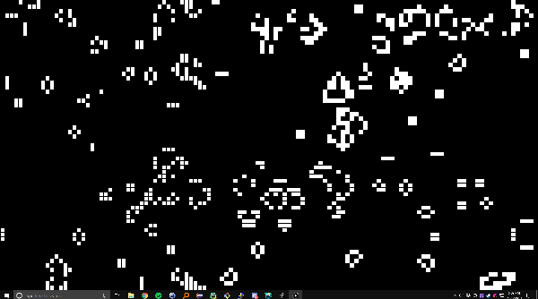
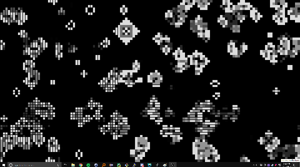

### 1. What is Processing?

Processing is a hybrid language/package/IDE for learning how to code. It's particularly well-suited for a graphics environment, with the main 2 functions being `setup()` and a `draw()` loop. It's very similar to Arduino, and in-fact the IDE is almost exactly the same as Arduino's, and there are many cross-compatibilities between the two. One of the first hardware projects I ever designed was a visual graph for the Digital Input 0 pin of my Arduino. It abstracts away most of the nasty graphics programming elements, like interfacing with lower-level libraries, and allows the developer to focus on the logic of the application, and more importantly, the looks of the end result. This also means that whenever Processing is ported to a new architecture, all the underlying graphics programming has already been accomplished.

This is why I was ecstatic when I found out about [Processing for Android](https://android.processing.org/). It's available as both a desktop extension for Processing (with Android Emulator support), and as an Android app with all the features of hte desktop version (git push/pull, compile to signed apk, live wallpaper, etc).  This has been especially powerful for me, as I've tried several times to pick up Android programming, but was turned off by the UI-driven design (despite my love for GUI development, ironically). 

When I first installed Processing for Android on my phone (APDE for short), I was pleased to find Conway's Game of Life as a sample. Putting a Game of Life live-wallpaper on my Android was one of the first things I did when I got my first smartphone. It was a simple black-and-white simulation, similar to the vanilla example provided by Processing. 

### 2. What is Conway's Game of Life?

The Game of Life(GoL) is a "Game" created by  British mathematician John Horton Conway in 1970, and is the quintessential example of "Cellular Automata". In short, cellular automatons are systems consisting of "cells", each having a number of states. In GoL there are only 2 states: alive and dead. With every discrete iteration, the cells change their current state based on a function of their current state, and the states of their neighbors. The GoL only has 4 simple rules:

<ol>
    <li> Any alive cell that is touching less than two alive neighbours dies. </li>
    <li> Any alive cell touching four or more alive neighbours dies. </li>
    <li> Any alive cell touching two or three alive neighbours does nothing. </li>
    <li> Any dead cell touching exactly three alive neighbours becomes alive. </li>
</ol>

From these 4 rules, very complex behaviors can emerge. Many different patterns or "lifeforms" have been observed, some so complex they can [self-replicate](https://en.wikipedia.org/wiki/Conway%27s_Game_of_Life#Self-replication) or even [simulate the GoL within itself](https://www.youtube.com/watch?v=xP5-iIeKXE8). It's an elegant example of how complexity can emerge from a simple set of rules.

### 3. GoL in Processing

The GoL is an example in the base distribution of Processing, so I'll include a link to it [here](https://github.com/processing/processing-android/blob/master/mode/examples/Topics/Cellular%20Automata/Conway/Conway.pde). However, it's a bit bland looking, and could use some sprucing-up. 

Since we want the wallpaper to fill fill the whole screen, we need to change the canvas size, from arbitrary numbers to `displayWidth` and `displayHeight`.

```java
void setup() {
  size(displayWidth, displayHeight, P2D);
  ...
}
```

The obvious first move would be to add variable cell-sizes, so your poor Samsung Galaxy doesn't get battered with a 2560x1440 sized world. We add `final int CELL_SIZE = 16;` to the top of our file. It could be any size, but 16x16px seems to look good on my display. 

`sx` and `sy`, the width and height of the world respectively, are recalculated by dividing by `CELL_SIZE`

```java
void setup() {
  ...
  sx = int(displayWidth/CELL_SIZE);
  sy = int(displayHeight/CELL_SIZE);
  ...
}
```

One can convert from grid to pixel coordinates by multiplying by `CELL_SIZE`, and pixel to grid by dividing. Having a helper function makes the code a lot cleaner.

```java
void setCell(int x, int y) {
  // x and y are pixel coordinates
  world[constrain(x/CELL_SIZE, 0, sx-1)][constrain(y/CELL_SIZE, 0, sy-1)][1] = 1;
}
```

Finally, we want to change the line where the pixels are `set(x, y, #FFFFFF)`, instead opting for `CELL_SIZE` squares. 

```java
      ...
      if ((world[x][y][1] == 1) || (world[x][y][1] == 0 && world[x][y][0] == 1)) 
      { 
        world[x][y][0] = 1; 
        rectMode(CORNER);
        rect(x*CELL_SIZE, y*CELL_SIZE, CELL_SIZE, CELL_SIZE); 
      } 
```


<sup>Looking good so far</sup>

But, the whole black-and-white aesthetic isn't really working for me; let's see if we can do even better.


### 4. Adding Fade and Color

The time-step evolution of the world looks really jerky, no matter how you mess with the framerate. Having cells fade away could give some extra dynamics to the display, as well as let the "player" know what just happened. 

To implement this, we're simply going to be using the `alpha` channel of the color, or it's transparency. We need to keep track of the alpha of each cell so it can be drawn correctly each time `draw()` is called.  

We start by creating a 2D array `int[][] alpha_map;`. We also create a `final int FADE_RATE` to subtract from each dying cell. I use 36. In `setup()`, we initialize values to 255 (full visibility) when we randomly turn on cells.

```java
void setup() {
  for (int i = 0; i < sx * sy * density; i++) { 
    int x = (int)random(sx);
    int y = (int)random(sy);
    world[x][y][1] = 1;
    alpha_map[x][y] = 255;
  } 
}
```

Anywhere where we turn on a cell in the `draw()` function, we must also reset the `alpha_map` value to be 255. Otherwise, we subtract the `FADE_RATE` from `alpha_map[x][y]`. Finally, we move the `fill()`, `rectMode()` and `rect()` drawing calls to the end of the `draw()` function and guard them with `if (alpha_mask[x][y] > 0)`. Alpha values should stay between 0 and 255. 


<sup>Grey cells are considered "dead" by the simulation and are being animated out of existence.</sup>

However, this is an Android live wallpaper. So we need a gaudy amount of RGB pallets moving around all over the place. Let's try coloring the cells based on their location in the picture.

Again, we create and initialize an array, this time of type `color`, and a constant `COLOR_SPEED` determining how fast they change. We also set the `colorMode` from `RGB` to `HSB`, which stands for Hue, Saturation, and Brightness, so we can directly manipulate the hue more effectively. 

```java
color[][] color_map;
final int COLOR_SPEED = 0.1;

void setup() {
  ...
  color_map = new color[sx][sy];
  ...
  colorMode(HSB, 255); // 255 is the max value 
}
```

Then, in the `draw()` function, the `color_map` is updated for each cell. Here, I'm using a circular function to calculate the hue by adding the `sin()` and `cos()` of the coordinates. 
```java
void draw() {
  for (int x = 0; x < sx; x=x+1) {
    for (int y = 0; y < sy; y=y+1) {
      color_map[x][y] = color(127*(sin(frameCount*COLOR_SPEED)*(float)x/sx)+127*(cos(frameCount*COLOR_SPEED)*(float)y/sy) + 127, 255, 255);
      ...
    }
  }  
  ...
}
```

### 5. Finishing Touches

Finally, we should give a little interactivity to this Wallpaper. After all, eventually the simulation will converge and stop producing any dynamic results. Touches/Clicks should bring the corresponding cell to life in the next frame. With the `setCell` function, this becomes trivial to make cross-platform:

```java
// Bring the current cell to life
void touchMoved() {
  setCell(mouseX, mouseY);
}

void mouseDragged() {
  setCell(mouseX, mouseY);
}
```

When done correctly, the final product should look something like this:

<div align="center">
    <iframe width="560" height="334" src="https://www.youtube.com/embed/4nCTgnbz2fM" frameborder="0" allow="accelerometer; autoplay; encrypted-media; gyroscope; picture-in-picture" allowfullscreen></iframe>
</div>

If you've been working with APDE this whole time, you can just change from `Demo` to `Wallpaper` in the Run menu, then fire away. If you've been working on the computer, I've found the fastest method is to use `git` to transfer the source to your phone, where APDE can quickly build a Live Wallpaper apk for you. 


This is just scratching the surface of what APDE can do. I hope to incorporate more of the Android API into my live wallpapers as development continues. 

[Source Code](https://github.com/samclane/GameOfLifeLiveWallpaper)